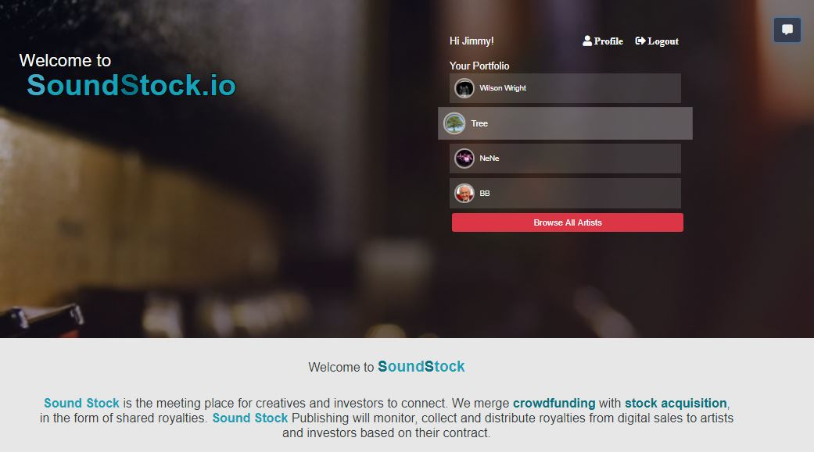

# [SoundStock.io](https://sound-stock.herokuapp.com/)
By Evan Wilson

### Guest Login 
email: guest@gmail.com
pass: 123456

*Sound Stock will be the meeting place for creators and investors to connect. The idea is to merge crowdfunding with stock acquisition, in the form of shared royalties. For now we will focus on the music industry. The artist will use SS to register music though their PRO (performance rights organization e.g. ascap, bmi, sesac) and to distribute music to all major digital music stores. SS will monitor, collect and distribute royalties to artists and investors based on their contract. SS will serve as Publisher of user content.*

### Under the hood
* Node
* MongoDB
* Express
* React
* Bootstrap/custom CSS

### Deployment
* Heroku

### Images

